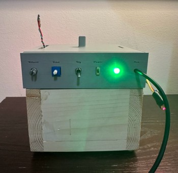
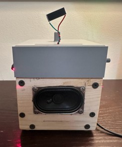
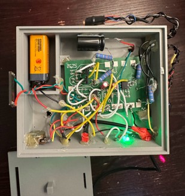

# Audio Amplifier and Speaker System - ECE4095

A battery-powered audio amplifier and speaker system with selectable aux and optical inputs, dual laser transmitter outputs, and a fully custom PCB. Designed as part of ECE 4095 at the University of Connecticut.


## Product Photos

| Front Panel | Rear / Speaker | Interior |
|---|---|---|
|  |  |  |

## Features

- Selectable **aux or optical (solar cell) input** via front-panel switch
- **Solar cell preamp stage** with high-pass filtering to match the weaker optical signal to aux levels
- Inverting **op-amp gain stage** with adjustable gain and volume potentiometers
- **Diode-biased BJT push-pull output stage** delivering ~2.5W peak into an 8Ω speaker with reduced crossover distortion
- **Dual laser transmitter outputs** with voltage follower isolation and DC-biased summing amplifier for optical audio transmission
- 9V battery powered with front-panel power switch and LED status indicator
- Custom PCB designed in **Altium Designer**, simulated in **LTspice**, enclosure modeled in **Fusion 360**

---

## System Design

### Input Stage
The aux input and solar cell photodetector are routed through a front-panel switch. Because the solar cell output (~0.35 Vrms) is significantly weaker than the aux input (~0.99 Vrms), a dedicated preamp stage boosts the optical signal before the main amplifier. A high-pass filter follows the preamp to reduce low-frequency noise from the solar cell.

### Main Amplifier
The main amplifier uses an op-amp in an inverting topology with a potentiometer in the feedback path for adjustable gain. A 10kΩ volume potentiometer at the input bleeds signal to ground for output level control. Because the op-amp alone cannot supply sufficient current to drive the speaker, a diode-biased BJT push-pull output stage provides the needed current gain. Diode biasing of the transistor pair reduces crossover distortion while keeping quiescent current low (~2 mA) for efficiency.

### Laser Output Stage
The selected input is buffered through a voltage follower for isolation, then fed into a non-inverting summing amplifier that introduces a DC bias required for laser diode modulation. Both laser outputs share this stage but are driven through separate current-limiting resistor paths.

## [Design Review Video](https://youtu.be/YMSiEr61HQ0)

---

## Hardware Summary

| Block | Details |
|---|---|
| Power | 9V battery, front-panel power switch, LED indicator |
| Input Selection | SPDT switch (aux / solar cell) |
| Solar Cell Preamp | Op-amp gain stage with high-pass filter |
| Main Amplifier | Inverting op-amp + diode-biased BJT push-pull output |
| Speaker Output | ~2.5W peak into 8Ω |
| Laser Outputs | 2× laser diodes with isolated op-amp drive paths |

---

## Repository Structure

```
├── ltspice/       # LTspice simulation files (.asc)
├── altium/        # Altium Designer schematic and PCB project files
├── fusion360/     # Fusion 360 enclosure design files
└── img/           # Project photos
└── pdf            # Project presentation
```